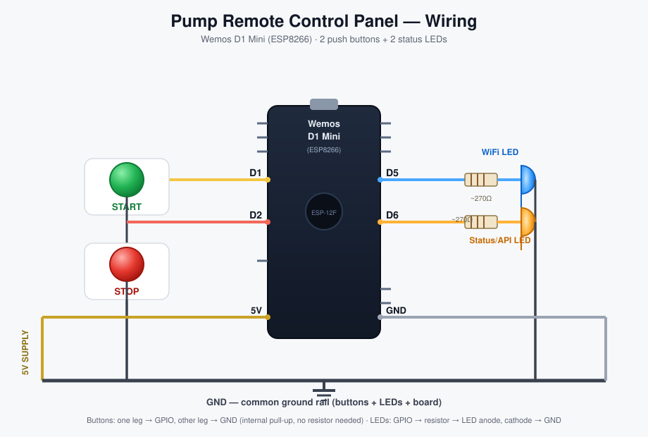

# 🚰 Smart Submersible Pump Controller (ESPHome)

[](https://github.com/manoranjan2050/Smart-Submersible-Pump-Controller-ESPHome/actions/workflows/validate.yml)
[](https://esphome.io)
[](https://home-assistant.io)
[](LICENSE)

A ready-to-install **ESPHome package** for single-phase submersible/borewell pumps. It turns a Wemos D1 Mini + a 2-channel relay + a PZEM-004T energy meter into a smart, WiFi-controlled starter with **dry-run protection**, **live energy monitoring**, and a **Home Assistant dashboard** — no C++ and almost no YAML to write yourself.

Point your ESPHome device file at this repository's package, add your WiFi details, and flash. Updates to the controller logic then ship to every device that uses the package with a one-line version bump — the same way any published ESPHome component works.

---

## 📸 Project Showcase

<p align="center">
  
  
</p>
<p align="center">
  
  
</p>

---

## ✨ Key Features

- **One-file setup** — your device YAML is ~10 lines; all logic lives in the shared [`packages/pump-controller.yaml`](packages/pump-controller.yaml).
- **Dry-Run Protection** — auto-stops the motor if current draw falls below a configurable threshold (protects against burnt-out pumps running dry).
- **Physical Running Feedback** — a `binary_sensor` derived from live current, so you know the motor is actually spinning, not just that a relay was pulsed.
- **Full Energy Monitoring** — Voltage, Current, Watts, Frequency, and cumulative kWh via PZEM-004T.
- **Dual-Phase Relay Control** — momentary 2–2.5 s pulses for Start/Stop, matching contactor-based motor starters.
- **WiFi Fallback Hotspot + Captive Portal** — if your network is unreachable, the device opens its own AP so you can reconfigure it without re-flashing.
- **OTA Updates** — flash once over USB, update wirelessly forever after.
- **Ready-made Home Assistant dashboard** — see [`home-assistant/dashboard.yaml`](home-assistant/dashboard.yaml).

---

## 🛠 Hardware Required

| Component | Purpose |
| :--- | :--- |
| **Wemos D1 Mini** (ESP8266) | The brain |
| **PZEM-004T V3.0** | AC voltage/current/energy monitoring |
| **2-Channel 5V Relay Module** | High-voltage Start/Stop switching |
| **Hi-Link HLK-PM01** (or similar) | Isolated 5V DC power supply |
| Your existing motor starter/contactor panel | Start & Stop pushbutton terminals |

## 📐 Wiring Guide

| Signal | Wemos D1 Mini Pin | Notes |
| :--- | :--- | :--- |
| Start relay | D1 (GPIO5) | Wired in parallel with the panel's Start pushbutton |
| Stop relay | D2 (GPIO4) | Wired in parallel with the panel's Stop pushbutton |
| PZEM RX | D5 (GPIO14) | To PZEM TX |
| PZEM TX | D6 (GPIO12) | To PZEM RX |

All pins and thresholds are overridable substitutions — see [Customization](#-customization) below.

> **⚠️ DANGER: HIGH VOLTAGE.** This project involves 230V AC wiring. Improper installation can cause electrical shock, fire, or motor damage. Always disconnect the main breaker before working on the panel, and if you're not confident with mains wiring, hire a licensed electrician.

---

## 🚀 Quick Start

Full step-by-step instructions (including first-time USB flashing) are in **[INSTALLATION.md](INSTALLATION.md)**. The short version, once ESPHome is set up:

**1. Create `secrets.yaml`** next to your device file (copy from [`secrets.yaml.example`](secrets.yaml.example)):

```yaml
wifi_ssid: "YourWiFiName"
wifi_password: "YourWiFiPassword"
api_encryption_key: "PASTE_A_BASE64_32_BYTE_KEY_HERE"
ota_password: "choose-a-strong-ota-password"
```

**2. Create your device file** (or copy [`smart-waterpump.yaml`](smart-waterpump.yaml)):

```yaml
substitutions:
  name: shop-waterpump
  friendly_name: Shop Waterpump

packages:
  pump_controller: github://manoranjan2050/Smart-Submersible-Pump-Controller-ESPHome/packages/pump-controller.yaml@main
```

**3. Flash it:**

```bash
esphome run smart-waterpump.yaml
```

That's it — sensors, dry-run protection, and the fallback AP all come from the package.

---

## ⚙️ Customization

Override any of these in your own device YAML's `substitutions:` block — your value always wins over the package default.

| Substitution | Default | Description |
| :--- | :--- | :--- |
| `name` | `smart-waterpump` | Device hostname / entity ID prefix |
| `friendly_name` | `Smart Waterpump` | Display name in Home Assistant |
| `board` | `d1_mini` | ESP8266 board type |
| `start_relay_pin` | `D1` | GPIO driving the Start relay |
| `stop_relay_pin` | `D2` | GPIO driving the Stop relay |
| `pzem_rx_pin` | `D5` | UART RX to the PZEM-004T |
| `pzem_tx_pin` | `D6` | UART TX to the PZEM-004T |
| `start_pulse_duration` | `2.5s` | How long the Start relay stays closed |
| `stop_pulse_duration` | `2s` | How long the Stop relay stays closed |
| `dry_run_amps` | `1.0` | Current (A) below which the motor is considered dry-running |
| `running_amps` | `0.5` | Current (A) above which the motor is considered running |
| `pzem_update_interval` | `2s` | How often the PZEM is polled |
| `ap_password` | `""` (open) | Password for the fallback WiFi hotspot |

Need something the package doesn't expose as a substitution — a second WiFi network, a static IP, extra automations? Redefine that top-level key (e.g. `wifi:`) in your device file; ESPHome merges package and device configs, with the device file always taking precedence. See [INSTALLATION.md § Advanced overrides](INSTALLATION.md#advanced-overrides) for examples.

---

## 🔴🟢 Optional: Physical Remote Control Panel

A second, standalone ESP8266 package — a wall-mounted button box with a Green (Start) and Red (Stop) button, plus two status LEDs — lives in [`packages/remote-control-panel.yaml`](packages/remote-control-panel.yaml). It doesn't talk to the pump controller directly; it calls the pump controller's existing `switch.*_start_pump` / `switch.*_stop_pump` entities through the Home Assistant API, exactly like tapping the dashboard tiles.

<p align="center">
  
</p>

| Signal | Wemos D1 Mini Pin | Notes |
| :--- | :--- | :--- |
| Green (Start) button | D1 (GPIO5) | Other leg to GND, internal pull-up, no resistor needed |
| Red (Stop) button | D2 (GPIO4) | Other leg to GND, internal pull-up, no resistor needed |
| WiFi status LED | D5 (GPIO14) | LED + ~220–330Ω resistor to GND — lit whenever WiFi is connected |
| API/HA status LED | D6 (GPIO12) | LED + ~220–330Ω resistor to GND — lit whenever the Home Assistant API link is up (i.e. button presses will actually work) |

Setup is the same pattern as the pump controller — copy [`remote-control-panel.yaml`](remote-control-panel.yaml), add the two extra secrets it needs (`remote_panel_api_encryption_key`, `remote_panel_ota_password` — see [`secrets.yaml.example`](secrets.yaml.example)), and flash. If your pump device isn't named `shop-waterpump`, override `start_switch_entity_id` / `stop_switch_entity_id` in its substitutions.

---

## 🏠 Home Assistant Dashboard

Import [`home-assistant/dashboard.yaml`](home-assistant/dashboard.yaml) as a Manual card (replace the `shop_waterpump` entity prefix with your own device's). It gives you live voltage/current gauges, power/energy/frequency tiles, and big Start/Stop buttons.

---

## 🩺 Troubleshooting

See [INSTALLATION.md § Troubleshooting](INSTALLATION.md#troubleshooting) for fixes to the most common issues (no PZEM readings, WiFi won't connect, dry-run trips too early/late, etc).

---

## 🤝 Contributing

Issues and PRs are welcome — especially wiring diagrams for other pump types, ESP32 variants, or additional protection features (overvoltage/undervoltage cutoff, run-time limits).

## 🙏 Credits

- **[@manoranjan2050](https://github.com/manoranjan2050)** — project author & maintainer

## 📝 License

Licensed under the [MIT License](LICENSE).
